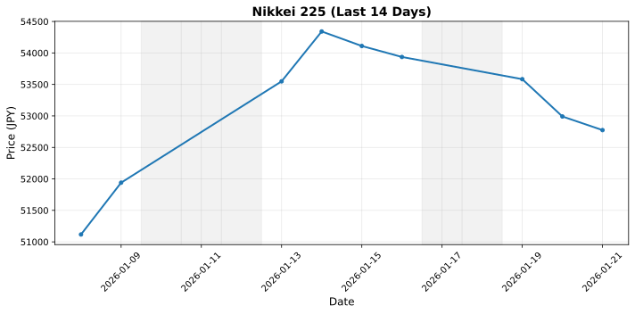

# 📊 Market Data Dashboard

このリポジトリは、日経平均、S&P 500、金価格の市場データを自動取得・可視化します。

## 📈 Charts

### 日経平均株価 (Nikkei 225)


### S&P 500


### 金価格 (Gold)


## 🤖 自動更新

GitHub Actionsにより、平日の日本時間18:00（UTC 9:00）に自動的にデータを更新しています。

手動で更新する場合：
1. [Actions](../../actions) タブを開く
2. "Update Market Data" ワークフローを選択
3. "Run workflow" をクリック

## 🛠️ ローカルでの実行

```bash
# 依存関係をインストール
pip install -r requirements.txt

# データを取得（過去14日分）
python fetch_market_data.py --days 14

# グラフを生成
python plot_market_chart.py
```

## 📝 データソース

- **日経平均**: Yahoo Finance (^N225)
- **S&P 500**: Yahoo Finance (^GSPC)
- **金価格**: Yahoo Finance (GC=F) - 円建て換算
