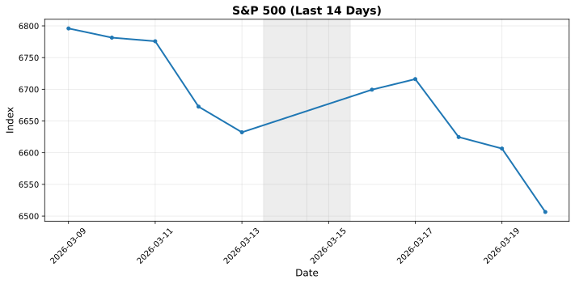
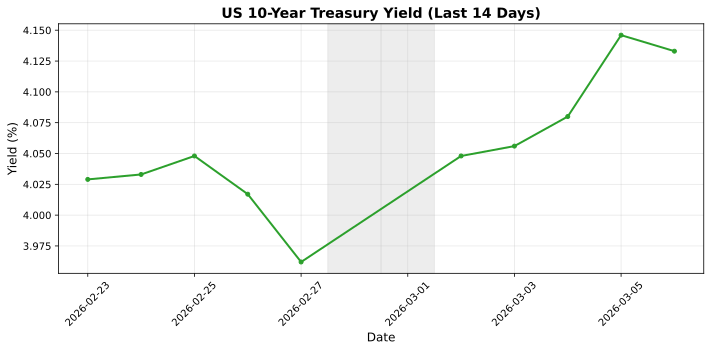

# 📊 Market Data Dashboard

S&P 500、WTI原油、米国10年債券金利の市場データを自動取得・可視化します。

## 📈 Charts

### S&P 500


### WTI Crude Oil


### US 10-Year Treasury Yield


## 🤖 自動更新

GitHub Actionsにより、平日22:00 UTC（米国市場終了後）に自動的にデータを更新しています。

手動で更新する場合：
1. [Actions](../../actions) タブを開く
2. "Daily Market Update" ワークフローを選択
3. "Run workflow" をクリック

## 🛠️ ローカルでの実行

```bash
pip install -r requirements.txt

# 過去14日分のデータを取得
python fetch_market_data.py --days 14

# グラフを生成
python plot_market_chart.py
```

## 📝 データソース

- **S&P 500**: Yahoo Finance (^GSPC) — USD
- **WTI Crude Oil**: Yahoo Finance (CL=F) — USD/barrel
- **US 10-Year Treasury Yield**: Yahoo Finance (^TNX) — %
